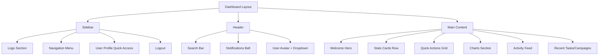
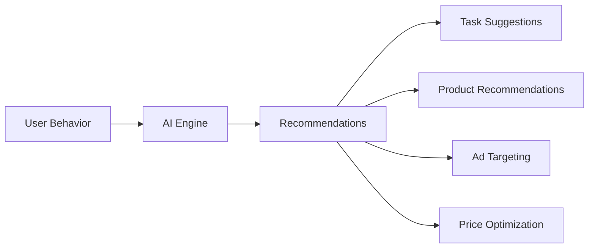

# HoverTask Comprehensive Enhancement Plan
## Matching SwiftKudi Professional Design

---

## Executive Summary

This plan outlines comprehensive enhancements to transform HoverTask into a professional, SEO-optimized platform matching SwiftKudi's design standards. The plan covers design system unification, dashboard enhancements, SEO optimization, AI integration, and trust indicators.

---

## 1. Design System Implementation

### 1.1 Color Palette Unification

| Element | Current | Target | Usage |
|---------|---------|--------|-------|
| Primary | `#3b82f6` / `#2C418F` | `#2C418F` | All primary buttons, links, accents |
| Primary Light | `#4b70f5` | `#4F6BED` | Hover states, highlights |
| Primary Dark | `#2563eb` | `#1a1a2e` | Active states, emphasis |
| Success | `#009a49` | `#10B981` | Positive actions, earnings |
| Warning | `#F59E0B` | `#F59E0B` | Alerts, pending states |
| Danger | `#ff5449` | `#EF4444` | Errors, cancellations |
| Background | `#f8fafc` | `#F8FAFC` | Page backgrounds |
| Surface | `#ffffff` | `#FFFFFF` | Cards, modals |
| Text Primary | `#1e293b` | `#1E293B` | Headings, body |
| Text Secondary | `#64748b` | `#64748B` | Captions, metadata |

### 1.2 Typography System

```
Font Families:
- Headings: 'Outfit', sans-serif (from public layout)
- Body: 'Inter', sans-serif (from dashboard)
- Monospace: 'JetBrains Mono', monospace (code/numbers)

Scale:
- Display: 48px / 600 weight
- H1: 36px / 700 weight
- H2: 30px / 600 weight
- H3: 24px / 600 weight
- H4: 20px / 500 weight
- Body Large: 18px / 400 weight
- Body: 16px / 400 weight
- Small: 14px / 400 weight
- Caption: 12px / 400 weight
```

### 1.3 Spacing System

```
Base unit: 4px

Spacing scale:
- xs: 4px
- sm: 8px
- md: 16px
- lg: 24px
- xl: 32px
- 2xl: 48px
- 3xl: 64px
- 4xl: 96px
```

### 1.4 Component Library

**Buttons:**
- Primary: `#2C418F` bg, white text, rounded-xl
- Secondary: White bg, `#2C418F` text, border
- Ghost: Transparent, hover bg-gray-100
- Danger: `#EF4444` bg for destructive actions

**Cards:**
- Background: white
- Border: 1px solid `#E2E8F0`
- Border-radius: 16px (rounded-2xl)
- Shadow: `0 1px 3px rgba(0,0,0,0.1)`
- Hover shadow: `0 4px 12px rgba(0,0,0,0.15)`

**Forms:**
- Input height: 48px
- Border radius: 12px
- Focus ring: 2px `#2C418F`
- Error state: red border + error message

---

## 2. Dashboard Enhancement

### 2.1 Dashboard Layout Redesign



### 2.2 Stats Cards Enhancement

| Card | Data Points | Visual |
|------|-------------|--------|
| Wallet Balance | Current balance, trend indicator | Green icon, up/down arrow |
| Total Adverts | Count, active vs paused | Blue icon, mini bar chart |
| Tasks Completed | Count, this week vs last | Purple icon, percentage change |
| Referrals | Count, earnings total | Amber icon, sparkline |
| Membership | Status, days remaining | Gold/gray icon |
| Points | Current points, level | Star icon, progress ring |

### 2.3 Charts Implementation

**Required Charts:**
1. **Earnings Chart** - Line chart showing daily/weekly/monthly earnings
2. **Task Completion Chart** - Bar chart showing tasks by platform
3. **Advert Performance** - Area chart showing impressions/clicks
4. **Referral Growth** - Funnel or growth chart

**Chart Library:** Chart.js or ApexCharts (via CDN)

### 2.4 Activity Feed

```
Activity Feed Components:
├── Recent Transactions
│   ├── Type (earn/spend/withdraw)
│   ├── Amount
│   ├── Status (pending/completed)
│   └── Timestamp
├── Task Updates
│   ├── Task name
│   ├── Status change
│   └── Time ago
├── Notification Highlights
│   ├── Message preview
│   ├── Read/unread indicator
│   └── Time ago
└── System Alerts
    ├── KYC reminder
    ├── Wallet low balance
    └── New features
```

### 2.5 Quick Actions Enhancement

| Action | Icon | Color | Target Page |
|--------|------|-------|-------------|
| Post Ad | `fa-bullhorn` | Blue | `/advertise/post` |
| Find Tasks | `fa-tasks` | Green | `/earn/tasks` |
| Browse Market | `fa-store` | Purple | `/marketplace` |
| Resell Products | `fa-chart-line` | Amber | `/earn/resell` |
| Fund Wallet | `fa-wallet` | Cyan | `/fund-wallet` |
| Refer Friends | `fa-users` | Pink | `/refer-and-earn` |
| View Analytics | `fa-chart-bar` | Indigo | Dashboard analytics |
| Support | `fa-headset` | Gray | `/contact` |

---

## 3. Page-Wide Consistency

### 3.1 Layout Unification

**Current Issues:**
- Dashboard uses Inter font, public pages use Outfit
- Different primary colors (#3b82f6 vs #2C418F)
- Inconsistent border-radius values
- Different spacing scales

**Solution:**
- Create central Tailwind config with design tokens
- Update all layouts to use same CSS variables
- Standardize component classes

### 3.2 Page Templates

| Page Type | Layout | Components |
|-----------|--------|------------|
| Landing | Public layout | Hero, Features, CTA, Footer |
| Dashboard | Main layout | Sidebar, Header, Content |
| Auth | Minimal layout | Centered card, logo |
| Settings | Main layout | Tabbed navigation |
| Public Pages | Public layout | Breadcrumb, content, sidebar |

### 3.3 Component Standardization

```
Standard Components to Create:
├── Buttons
│   ├── ButtonPrimary
│   ├── ButtonSecondary
│   ├── ButtonGhost
│   └── ButtonDanger
├── Cards
│   ├── Card
│   ├── CardStat
│   ├── CardAction
│   └── CardChart
├── Forms
│   ├── Input
│   ├── Select
│   ├── Checkbox
│   ├── Radio
│   └── Toggle
├── Navigation
│   ├── Sidebar
│   ├── Header
│   ├── Breadcrumb
│   └── Pagination
├── Display
│   ├── Avatar
│   ├── Badge
│   ├── Tag
│   └── Toast
└── Data
    ├── Table
    ├── List
    └── Timeline
```

---

## 4. On-Page SEO Implementation

### 4.1 Meta Tags Structure

```html
<!-- Primary Meta Tags -->
<title>Page Title | Hovertask</title>
<meta name="title" content="Page Title | Hovertask">
<meta name="description" content="Page description (150-160 chars)">
<meta name="keywords" content="keyword1, keyword2, keyword3">
<meta name="author" content="Hovertask">
<meta name="robots" content="index, follow">

<!-- Open Graph / Facebook -->
<meta property="og:type" content="website">
<meta property="og:url" content="https://hovertask.com/page">
<meta property="og:title" content="Page Title">
<meta property="og:description" content="Description">
<meta property="og:image" content="https://hovertask.com/images/og-image.jpg">
<meta property="og:site_name" content="Hovertask">

<!-- Twitter -->
<meta property="twitter:card" content="summary_large_image">
<meta property="twitter:url" content="https://hovertask.com/page">
<meta property="twitter:title" content="Page Title">
<meta property="twitter:description" content="Description">
<meta property="twitter:image" content="https://hovertask.com/images/og-image.jpg">

<!-- Canonical -->
<link rel="canonical" href="https://hovertask.com/page">
```

### 4.2 Page-Specific SEO

| Page | Title | Description | Keywords |
|------|-------|-------------|----------|
| Home | Earn or Advertise on Social Media - Hovertask | Earn money by completing social media tasks or advertise your products to thousands of users in Nigeria | earn money online, social media tasks, advertise business, Nigeria |
| About | About Us - Hovertask | Learn about Hovertask's mission to create earning opportunities for Nigerians | about hovertask, earn online Nigeria, social media marketing |
| Marketplace | Marketplace - Buy & Sell Products | Browse thousands of products or list your own for resale | marketplace Nigeria, buy and sell, online shop |
| FAQ | Frequently Asked Questions - Hovertask | Find answers to common questions about earning and advertising on Hovertask | faq, help, support |
| Contact | Contact Us - Hovertask | Get in touch with our support team | contact, support, help |
| Dashboard | Dashboard - Manage Your Account | View your earnings, manage tasks, and track performance | dashboard, account management |
| Earn Tasks | Complete Tasks & Earn Money | Browse and complete social media tasks to earn money | earn money,完成任务,make money online |
| Advertise | Advertise Your Business | Create ads and reach thousands of potential customers | advertising, digital marketing, promote business |
| Wallet | Wallet - Manage Your Funds | Fund your wallet, withdraw earnings, view transaction history | wallet, withdraw, fund account |

### 4.3 Structured Data (JSON-LD)

```json
{
  "@context": "https://schema.org",
  "@type": "WebApplication",
  "name": "Hovertask",
  "description": "Platform to earn money through social media tasks or advertise products",
  "url": "https://hovertask.com",
  "applicationCategory": "BusinessApplication",
  "operatingSystem": "Web, Android, iOS",
  "offers": {
    "@type": "Offer",
    "price": "0",
    "priceCurrency": "NGN"
  },
  "creator": {
    "@type": "Organization",
    "name": "Hovertask",
    "url": "https://hovertask.com"
  }
}
```

### 4.4 Semantic HTML

```html
<!-- Header -->
<header>
  <nav role="navigation" aria-label="Main navigation">
    <ul>
      <li><a href="/">Home</a></li>
      <li><a href="/marketplace">Marketplace</a></li>
    </ul>
  </nav>
</header>

<!-- Main Content -->
<main>
  <article>
    <h1>Page Title</h1>
    <section>
      <h2>Section Title</h2>
      <p>Content...</p>
    </section>
  </article>
  
  <aside>
    <h2>Related Content</h2>
  </aside>
</main>

<!-- Footer -->
<footer>
  <nav role="navigation" aria-label="Footer navigation">
  </nav>
  <address>Contact information</address>
</footer>
```

---

## 5. Technical SEO Implementation

### 5.1 Sitemap Generation

```xml
<!-- public/sitemap.xml -->
<?xml version="1.0" encoding="UTF-8"?>
<urlset xmlns="http://www.sitemaps.org/schemas/sitemap/0.9">
  <url>
    <loc>https://hovertask.com/</loc>
    <lastmod>2026-03-14</lastmod>
    <changefreq>daily</changefreq>
    <priority>1.0</priority>
  </url>
  <url>
    <loc>https://hovertask.com/about</loc>
    <lastmod>2026-03-14</lastmod>
    <changefreq>monthly</changefreq>
    <priority>0.8</priority>
  </url>
  <url>
    <loc>https://hovertask.com/marketplace</loc>
    <lastmod>2026-03-14</lastmod>
    <changefreq>daily</changefreq>
    <priority>0.9</priority>
  </url>
  <!-- More pages -->
</urlset>
```

### 5.2 robots.txt Update

```
User-agent: *
Allow: /

# Sitemaps
Sitemap: https://hovertask.com/sitemap.xml

# Disallow admin/private areas
Disallow: /dashboard/
Disallow: /api/
Disallow: /admin/
Disallow: /_nuxt/
```

### 5.3 Performance Optimization

| Optimization | Target | Implementation |
|--------------|--------|----------------|
| First Contentful Paint | < 1.5s | Optimize CSS delivery |
| Largest Contentful Paint | < 2.5s | Lazy load images |
| Time to Interactive | < 3.5s | Code splitting |
| Cumulative Layout Shift | < 0.1 | Reserve image dimensions |
| First Input Delay | < 100ms | Minimize JS blocking |

**Implementation:**
- Implement Laravel Mix/Vite for asset bundling
- Enable gzip/brotli compression
- Set cache headers for static assets
- Use WebP image format
- Implement lazy loading for images
- Defer non-critical JavaScript

### 5.4 Mobile Responsiveness

**Responsive Breakpoints:**
```css
/* Mobile first */
--breakpoint-sm: 640px;  /* Large phones */
--breakpoint-md: 768px;  /* Tablets */
--breakpoint-lg: 1024px; /* Laptops */
--breakpoint-xl: 1280px; /* Desktops */
--breakpoint-2xl: 1536px; /* Large screens */
```

**Mobile Checklist:**
- [ ] Touch-friendly tap targets (min 44x44px)
- [ ] Readable font sizes (min 16px)
- [ ] Proper viewport meta tag
- [ ] No horizontal scrolling
- [ ] Mobile navigation menu
- [ ] Optimized images for mobile
- [ ] Fast tap interactions

### 5.5 URL Structure Optimization

**Current URLs:**
- `/dashboard` ✓
- `/dashboard/advertise` ✓
- `/earn/tasks` ✓

**Recommendations:**
- Use lowercase URLs
- Use hyphens as word separators
- Keep URLs short and descriptive
- Implement 301 redirects for changed URLs
- Remove trailing slashes consistently

---

## 6. Off-Page SEO Strategy

### 6.1 Backlink Strategy

| Source Type | Target | Priority |
|-------------|--------|----------|
| Social Media | Facebook, Twitter, Instagram, LinkedIn | High |
| Business Directories | Nigeria business listings | High |
| Guest Posting | Finance/tech blogs | Medium |
| Press Releases | News distribution | Medium |
| Influencer Marketing | Nigerian influencers | Medium |

### 6.2 Social Media Integration

**Share Cards:**
- Create OG images for each page type
- Implement Twitter Card markup
- Add social sharing buttons

**Social Profiles to Optimize:**
- Facebook: @hovertaskng
- Twitter/X: @hovertaskng
- Instagram: @hovertaskng
- LinkedIn: Hovertask
- TikTok: @hovertaskng
- YouTube: @Hovertaskng

### 6.3 Content Strategy

| Content Type | Frequency | Purpose |
|--------------|-----------|---------|
| Blog Posts | Weekly | SEO, traffic |
| Success Stories | Monthly | Trust, social proof |
| How-to Guides | Bi-weekly | SEO, engagement |
| Product Updates | As needed | Retention |
| Community Highlights | Weekly | Engagement |

---

## 7. AI Integration Plan

### 7.1 Smart Recommendations



**AI Features:**
1. **Task Recommendations** - Suggest tasks based on user platform strengths
2. **Product Recommendations** - Recommend products to resell based on audience
3. **Ad Optimization** - Suggest best times, platforms, audiences for ads
4. **Pricing Intelligence** - Optimal pricing suggestions for resellers
5. **Fraud Detection** - Identify suspicious activities

### 7.2 Analytics Dashboard

**AI-Powered Analytics:**
- Earnings predictions
- Trend analysis
- Performance benchmarks
- Anomaly detection
- Growth projections

### 7.3 Virtual Assistant

**Chatbot Features:**
- 24/7 customer support
- Task guidance
- Account troubleshooting
- FAQ automation
- Escalation to human agents

### 7.4 Implementation Options

| Option | Cost | Complexity | Features |
|--------|------|------------|----------|
| Rule-based | Low | Low | Basic automation |
| ML Models | Medium | Medium | Predictions, recommendations |
| LLM Integration | High | High | Natural language, complex queries |

---

## 8. Trust Indicators Implementation

### 8.1 Security Badges

| Badge | Placement | Purpose |
|-------|-----------|---------|
| SSL Certificate | All pages | Secure connection |
| Payment Security | Wallet, checkout | Trust in payments |
| Data Protection | Forms, account | Privacy assurance |
| KYC Verified | User profiles | Identity verification |

### 8.2 Certifications & Trust Seals

```
Available Certifications:
├── SSL/TLS Certificate
├── PCI DSS Compliance (Payment)
├── NDPR Compliance (Data Protection)
├── CAC Registration (Nigeria)
└── CyberShield Certification
```

### 8.3 Testimonials Section

**Testimonial Components:**
- User photo and name
- Testimonial text (quote)
- Date
- Platform/role (Earner/Advertiser)
- Video testimonials (optional)

**Display Locations:**
- Homepage hero section
- About page
- Landing pages
- Email signatures

### 8.4 Statistics & Social Proof

**Trust Statistics to Display:**
- 500k+ Members
- 120k+ Downloads
- 123k+ Advertisers
- 15M+ Ad Views
- ₦X Million Paid to Users
- 99.9% Uptime
- 4.8+ App Rating

### 8.5 Media Features

**Press/Media Mentions:**
- Display logos of featured publications
- Link to press releases
- Awards and recognitions

### 8.6 Contact Information

**Trust-Building Contact Info:**
- Physical address (Nigeria)
- Phone number
- Email address
- Business hours
- Live chat
- Social media links

---

## Implementation Roadmap

### Phase 1: Design System (Week 1-2)
- [ ] Unify color palette across all pages
- [ ] Standardize typography
- [ ] Update Tailwind configuration
- [ ] Create component library
- [ ] Apply consistent spacing

### Phase 2: Dashboard Enhancement (Week 2-3)
- [ ] Redesign stats cards with charts
- [ ] Add activity feed
- [ ] Implement real-time updates
- [ ] Create quick actions grid
- [ ] Add analytics visualizations

### Phase 3: SEO Implementation (Week 3-4)
- [ ] Add meta tags to all pages
- [ ] Implement structured data
- [ ] Generate XML sitemap
- [ ] Update robots.txt
- [ ] Implement canonical URLs
- [ ] Add semantic HTML

### Phase 4: Technical SEO (Week 4-5)
- [ ] Optimize page speed
- [ ] Implement lazy loading
- [ ] Mobile optimization
- [ ] URL structure improvement
- [ ] Cache optimization

### Phase 5: Trust Indicators (Week 5-6)
- [ ] Add security badges
- [ ] Create testimonials section
- [ ] Display statistics
- [ ] Add contact information
- [ ] Implement trust seals

### Phase 6: AI Integration (Week 6-8)
- [ ] Build recommendation engine
- [ ] Implement analytics dashboard
- [ ] Create chatbot
- [ ] Add fraud detection

---

## Files to Modify

### Blade Templates
- `resources/views/layouts/main.blade.php`
- `resources/views/layouts/public.blade.php`
- `resources/views/dashboard/index.blade.php`
- All page templates in `resources/views/pages/`
- All dashboard templates in `resources/views/dashboard/`

### Configuration
- `tailwind.config.js` (or create design tokens CSS)
- `resources/css/app.css`
- `package.json` (for chart libraries)

### Public Assets
- `public/robots.txt`
- Create `public/sitemap.xml`
- Create OG images in `public/images/`

### Routes
- Update route names for consistency
- Add SEO-friendly URL routes

---

## Success Metrics

| Metric | Current | Target | Measurement |
|--------|---------|--------|-------------|
| Page Load Speed | TBD | < 2s | Google PageSpeed |
| Mobile Score | TBD | 90+ | Google Mobile-Friendly |
| SEO Score | 0 | 80+ | Ahrefs/Moz |
| Bounce Rate | TBD | < 50% | Google Analytics |
| Trust Signals | None | 10+ | Manual audit |
| Design Consistency | 50% | 100% | Component audit |

---

## Conclusion

This comprehensive plan addresses all aspects of HoverTask's enhancement to match SwiftKudi's professional design while implementing industry-standard SEO practices. The phased approach allows for incremental improvements with measurable results at each stage.

**Key Priorities:**
1. Design system unification (immediate)
2. Dashboard enhancement (high priority)
3. SEO implementation (high priority)
4. Trust indicators (medium priority)
5. AI integration (long-term)

**Total Estimated Timeline:** 8 weeks
